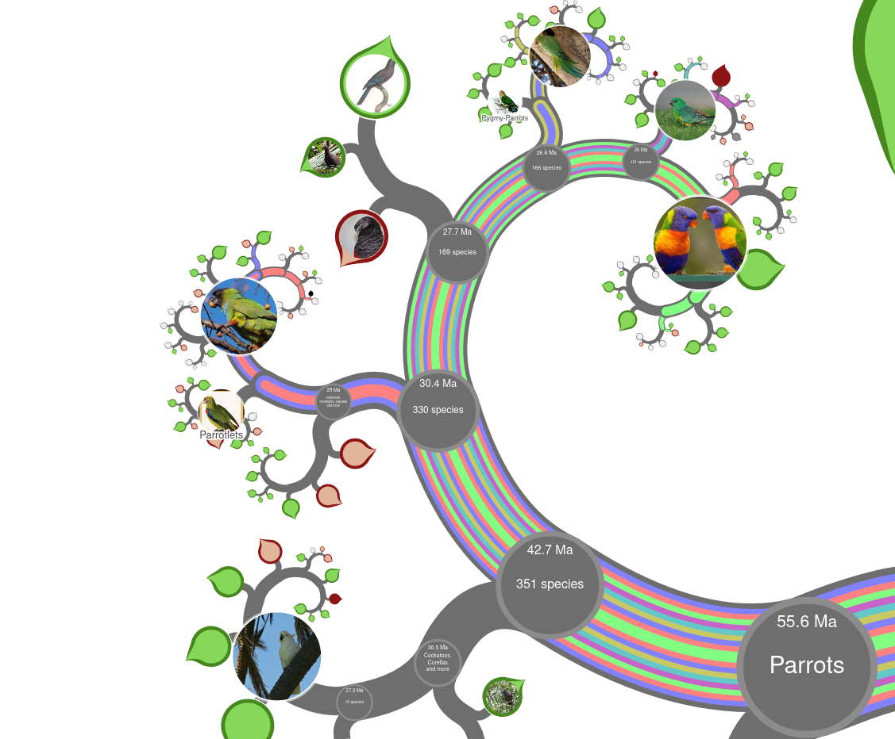

# Assignment for BookLab Course

## The Parrots: Visualizing Print and Digital Data

Object: _Illustrations of the family of Psittacidae, or parrots: the greater part of them species hitherto unfigured : containing forty-two lithographic plates, drawn from life, and on stone_, author Edward Lear

Object 2: _Statistical Atlas of the United States Based on the results of the Ninth Census 1870_, author Francis A. Walker

Out of the many books of images and illustrations, I selected two that seemed to be particularly focused on displaying data. The displays of the statistics from the 1870 census is clearly based on data, and then visualized. The book of the parrots feels more artful, but it is using the scientific classifications of the birds in order to display them both for art and communicating information about the birds to people who would not otherwise recognize or see the animals. The connection between the two is how much the way people now communicate this type of information. Both share similarities with modern displays of statistics or species, but they also have unique mannerisms that we would not see in a modern format or even most modern books.

## Statistical Atlas

This atlas has a variety of data visualizations. These include maps of population density (including center of population markers) and charts showing classification of people, such as by religious denomination, race, or citizenship.

These visualizations feel like something that would come from a software visualization program. I think about the challenges of wrangling data for a large map today, and it would be significant. For these sorts of visualizations in a book in the late 1800s, the amount of work would be much more significant.

I wonder how they would be viewed by someone who does not see these things in every issue of the newspaper. Many NYT articles I would read on a daily basis would have similar charts. My impression based on the book would be that these would be the exception in terms of available visuals. These do not come with interpretations. In some cases, there can be implied meanings based on the way they display race and immigration, but there is not text assisting the viewer in how the country or the individual should be making decisions based on this information. This is an entirely different setting than how I am familiar with seeing visualized data.

## Illustrations of the family of Psittacidae

The [Gutenberg e-book](https://www.gutenberg.org/files/46392/46392-h/46392-h.htm) version shows a literal translation of the object to a web page, with each parrot’s image and name.

After the lab, I went to look up the parrots. I focused on using onezoom.org to see how the birds were related. I was surprised to find that many of the birds in the book no longer are called by the names given, either the common or scientific names. Some of the separate species are now considered to be the same species.

In thinking how to  visualize these images differently, I tried putting each bird in the tree. The website allows for tracing a path between the species, but not saving that path. Because I could, unfortunately, not save a link to the tree, I am instead including a screenshot that shows a selection of the species, as well as a table linking from the image in the book to the modern classification on the One Zoom tree.

| Lear Name                   | One Zoom Link                  |
|-----------------------------|--------------------------------|
| Psittacus badiceps          | [Pionites leucogaster](https://www.onezoom.org/life/@Pionites=682882?img=best_any&anim=flight#x939,y1367,w2.6872)           |
| Plyctolophus rosaceus       | [Cacatua moluccensis](https://www.onezoom.org/life/@Cacatua_moluccensis=959831?img=best_any&anim=flight#x58,y176,w1.1943)            |
| Plyctolophus galeritus      | [Cacatua galerita](https://www.onezoom.org/life/@Cacatua_galerita=290349?img=best_any&anim=flight#x430,y675,w0.5342)               |
| Plyctolophus sulphureus     | [Cacatua galerita](https://www.onezoom.org/life/@Cacatua_galerita=290349?img=best_any&anim=flight#x430,y675,w0.5342)               |
| Plyctolophus Leadbeateri    | [Cacatua leadbeateri](https://www.onezoom.org/life/@Cacatua_leadbeateri=209184?img=best_any&anim=flight#x335,y598,w0.4831)           |
| Calyptorhynchus Baudinii    | [Calyptorhynchus baudinii](https://www.onezoom.org/life/@Calyptorhynchus_baudinii=716374?img=best_any&anim=flight#x431,y968,w1.1943)       |
| Macrocercus Aracanga        | [Ara macao](https://www.onezoom.org/life/@Ara_macao=851014?img=best_any&anim=flight#x952,y563,w1.1943)                      |
| Macrocercus Ararauna        | [Ara ararauna](https://www.onezoom.org/life/@Ara_ararauna=1020127?img=best_any&anim=flight#x308,y-5,w1.1943)                   |
| Macrocercus hyacinthinus    | [Anodorhynchus hyacinthinus](https://www.onezoom.org/life/@Anodorhynchus=717642?img=best_any&anim=flight#x592,y295,w0.2501)     |
| Psittacara Patachonica      | [Cyanoliseus patagonus](https://www.onezoom.org/life/@Cyanoliseus_patagonus=682871?img=best_any&anim=flight#x431,y968,w1.1943)          |
| Psittacara leptorhyncha     | [Enicognathus leptorhynchus](https://www.onezoom.org/life/@Enicognathus=267639?img=best_any&anim=flight#x519,y470,w0.5317)     |
| Psittacara nana             | [Aratinga nana]( https://www.onezoom.org/life/@Aratinga_nana=954895?img=best_any&anim=flight#x308,y-5,w1.1943)                 |
| Nanodes undulatus           | [Melopsittacus undulatus](https://www.onezoom.org/life/@Melopsittacus_undulatus=734818?img=best_any&anim=flight#x-37,y470,w1.1943)        |
| Platycercus erythropterus   | [Aprosmictus erythropterus](https://www.onezoom.org/life/@Aprosmictus=417922?img=best_any&anim=flight#x286,y-532,w2.6872)      |
| Platycercus Tabuensis       | [Alisterus scapularis](https://www.onezoom.org/life/@Alisterus=682886?img=best_any&anim=flight#x965,y-414,w2.6872)           |
| Platycercus Baueri          | [Prosopeia tabuensis](https://www.onezoom.org/life/@Prosopeia_tabuensis=231512?img=best_any&anim=flight&pop=ol_231512#x952,y563,w1.1943)            |
| Platycercus Barnardi        | [Barnardius zonarius](https://www.onezoom.org/life/@Barnardius_zonarius=57350)            |
| Platycercus palliceps       | [Platycercus adscitus](https://www.onezoom.org/life/@Platycercus_adscitus=771955?img=best_any&anim=flight#x914,y257,w1.1943)           |
| Platycercus Brownii         | [Platycercus venustus](https://www.onezoom.org/life/@Platycercus_venustus=209187?img=best_any&anim=flight#x-33,y532,w1.1943)           |
| Platycercus pileatus        | [Purpureicephalus spurius](https://www.onezoom.org/life/@Purpureicephalus_spurius=393109?img=best_any&anim=flight#x899,y229,w1.1943)       |
| Platycercus Stanleyii       | [Platycercus icterotis](https://www.onezoom.org/life/@Platycercus=512910?img=best_any&anim=flight#x-331,y1106,w2.6872)          |
| Platycercus unicolor        | [Cyanoramphus unicolor](https://www.onezoom.org/life/@Cyanoramphus_unicolor=344229?img=best_any&anim=flight#x308,y-5,w1.1943)          |
| Platycercus Pacificus       | [Cyanoramphus novaezelandiae](https://www.onezoom.org/life/@Cyanoramphus_novaezelandiae=818316?img=best_any&anim=flight#x98,y811,w1.1943)    |
| Palæornis Novæ Hollandiæ    | [Nymphicus hollandicus](https://www.onezoom.org/life/@Nymphicus_hollandicus=630645?img=best_any&anim=flight#x368,y-21,w1.1943)          |
| Palæornis melanura          | [Polytelis anthopeplus](https://www.onezoom.org/life/@Polytelis_anthopeplus=512914?img=best_any&anim=flight#x-36,y501,w1.1943)          |
| Palæornis anthopeplus       | [Polytelis anthopeplus](https://www.onezoom.org/life/@Polytelis_anthopeplus=512914?img=best_any&anim=flight#x-36,y501,w1.1943)          |
| Palæornis rosaceus          | [Polytelis alexandrae](https://www.onezoom.org/life/@Polytelis=512913?img=best_any&anim=flight&pop=ol_435948#x939,y1367,w2.6872)           |
| Palæornis Columboïdes       | [Psittacula columboides](https://www.onezoom.org/life/@Psittacula_columboides=864236?img=best_any&anim=flight#x98,y811,w1.1943)         |
| Palæornis cucullatus        | [Psittacula eupatria](https://www.onezoom.org/life/@Psittacula_eupatria=339566?img=best_any&anim=flight#x-33,y532,w1.1943)            |
| Palæornis torquatus         | [Psittacula krameri](https://www.onezoom.org/life/@Psittacula_krameri=1020124?img=best_any&anim=flight&pop=ol_1020124#x914,y257,w1.1943)             |
| Trichoglossus rubritorquis  | [Trichoglossus rubritorquis](https://en.wikipedia.org/wiki/Red-collared_lorikeet)     |
| Trichoglossus Matoni        | [Trichoglossus chlorolepidotus](https://www.onezoom.org/life/@Trichoglossus_chlorolepidotus=293722?img=best_any&anim=flight#x338,y-14,w1.1943)  |
| Trichoglossus versicolor    | [Psitteuteles versicolor](https://www.onezoom.org/life/@Psitteuteles=799910?img=best_any&anim=flight#x965,y-414,w2.6872)        |
| Lorius Domicella            | [Lorius domicella](https://www.onezoom.org/life/@Lorius_domicella=3600319?img=best_any&anim=flight#x755,y873,w1.1943)               |
| Psittacula Kuhlii           | [Vini kuhlii](https://www.onezoom.org/life/@Vini_kuhlii=3600297?img=best_any&anim=flight#x946,y594,w1.1943)                    |
| Psittacula Tarantæ          | [Agapornis taranta](https://www.onezoom.org/life/@Agapornis_taranta=174400?img=best_any&anim=flight#x899,y229,w1.1943)              |
| Psittacula torquata         | [Psittacula eques](https://www.onezoom.org/life/@Psittacula_eques=3600369?img=best_any&anim=flight#x40,y202,w1.1943)               |
| Psittacula rubrifrons       | [Cyanoramphus novaezelandiae](https://www.onezoom.org/life/@Cyanoramphus_novaezelandiae=818316?img=best_any&anim=flight#x98,y811,w1.1943)    |
| Psittacula Swinderniana     | [Agapornis swinderniana](https://en.wikipedia.org/wiki/Black-collared_lovebird)         |

This table shows the name in Lear’s book, and the current scientific name with a link to One Zoom’s listing for the bird. Two of these did not appear in the OneZoom tree. These have links to the Wikipedia pages.

This method of visualization takes a very different approach. Where the original book is mainly a list of beautiful birds, showing them in a tree format draws out their relationships. It also does not focus on a single image, but allows a reader to quickly flip through many images. I do not believe a tree format would be a “better” format, even than a collection of images of the pages of the books. However, I think it would tell a distinct story. Instead of focusing on the artistic representations of the parrots and the beauty of the birds themselves, it would focus on the scientific study of the birds, and their position in their environments. Painting of parrots could inspire awe in the viewer, but

These examples illustrate the cliché issue of information overload well. When looking at the birds in the illustrated book, it is easy to focus on specific details and features of the birds. However, when looking at OneZoom, the relationships and context distract from any particular birds.

These two displays have distinct priorities. Where the book looks at the details and the bodies of the birds, the tree display looks and the biology and phylogeny of the birds.

